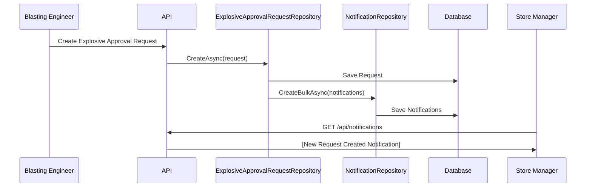
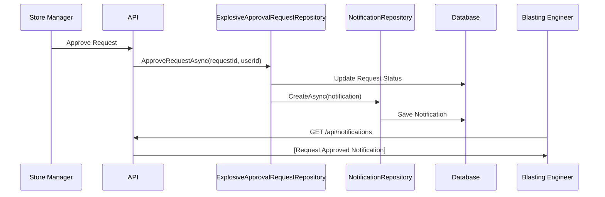

# ✅ Notification System - Phase 3 Complete: Workflow Integration

## 🎉 Implementation Summary

Phase 3 is complete! I've successfully integrated notification creation into the **Explosive Approval Request workflow**. Now, when Store Managers approve or reject requests, and when Blasting Engineers create requests, **notifications are automatically created and stored in the database**!

---

## 📦 What Has Been Implemented

### ✅ Phase 3: Workflow Integration (COMPLETE)

#### 1. **User Repository Enhancement**
Added method to get users by role and region:

**Interface Update:**
- `IUserRepository` - Added `GetByRoleAndRegionAsync(string role, string? region = null)`

**Implementation:**
- `UserRepository` - Queries users by role and optionally filters by region
- Supports finding all Store Managers in a specific region

**Files Modified:**
```
Application/Interfaces/UserManagement/IUserRepository.cs
Infrastructure/Repositories/UserManagement/UserRepository.cs
```

---

#### 2. **Explosive Approval Request Repository Integration**

**Dependencies Injected:**
- `INotificationRepository` - For creating notifications
- `IUserRepository` - For finding Store Managers and getting user details

**Integrated Notification Creation in 3 Key Methods:**

##### A. **CreateAsync()** - New Request Created
**Trigger:** Blasting Engineer creates a new explosive approval request

**Notification Recipients:** All Store Managers in the same region as the project

**Notification Details:**
- **Type:** `ExplosiveRequestCreated`
- **Title:** "New Explosive Approval Request"
- **Message:** "{Engineer} has submitted a new explosive approval request for {Site} ({Project}). Expected usage date: {Date}."
- **Priority:** Matches request priority (Normal/High/Critical)
- **Action URL:** `/store-manager/requests/{requestId}`

**Features:**
- Bulk notification creation for multiple Store Managers
- Priority mapping from request priority
- Comprehensive error handling (doesn't fail request creation if notification fails)

---

##### B. **ApproveRequestAsync()** - Request Approved
**Trigger:** Store Manager approves the explosive approval request

**Notification Recipient:** The Blasting Engineer who created the request

**Notification Details:**
- **Type:** `ExplosiveRequestApproved`
- **Title:** "Explosive Request Approved"
- **Message:** "Your explosive approval request for {Site} has been approved by {StoreManager}. Blasting scheduled for {Date} at {Time}."
- **Priority:** `High`
- **Action URL:** `/blasting-engineer/site-dashboard/{siteId}`

**Features:**
- Includes approver's name
- Shows blasting date and timing
- Direct link to site dashboard

---

##### C. **RejectRequestAsync()** - Request Rejected
**Trigger:** Store Manager rejects the explosive approval request

**Notification Recipient:** The Blasting Engineer who created the request

**Notification Details:**
- **Type:** `ExplosiveRequestRejected`
- **Title:** "Explosive Request Rejected"
- **Message:** "Your explosive approval request for {Site} was rejected by {StoreManager}. Reason: {Reason}"
- **Priority:** `High`
- **Action URL:** `/blasting-engineer/site-dashboard/{siteId}`

**Features:**
- Includes rejector's name
- Shows rejection reason
- Direct link to site dashboard

---

**File Modified:**
```
Infrastructure/Repositories/ProjectManagement/ExplosiveApprovalRequestRepository.cs
```

---

## 🔄 Complete Workflow with Notifications

### Scenario: Blasting Engineer Requests Explosive Approval



### Scenario: Store Manager Approves Request



---

## 📊 Notification Examples

### 1. Request Created (to Store Manager)
```json
{
  "id": 1,
  "userId": 5,
  "type": 100,
  "title": "New Explosive Approval Request",
  "message": "John Smith has submitted a new explosive approval request for Site Alpha (Mining Project North). Expected usage date: Jan 15, 2026.",
  "priority": 2,
  "isRead": false,
  "relatedEntityType": "ExplosiveApprovalRequest",
  "relatedEntityId": 42,
  "actionUrl": "/store-manager/requests/42",
  "createdAt": "2026-01-10T10:30:00Z"
}
```

### 2. Request Approved (to Blasting Engineer)
```json
{
  "id": 2,
  "userId": 3,
  "type": 101,
  "title": "Explosive Request Approved",
  "message": "Your explosive approval request for Site Alpha has been approved by Sarah Johnson. Blasting scheduled for Jan 15, 2026 at 09:00 AM.",
  "priority": 2,
  "isRead": false,
  "relatedEntityType": "ExplosiveApprovalRequest",
  "relatedEntityId": 42,
  "actionUrl": "/blasting-engineer/site-dashboard/15",
  "createdAt": "2026-01-11T14:20:00Z"
}
```

### 3. Request Rejected (to Blasting Engineer)
```json
{
  "id": 3,
  "userId": 3,
  "type": 102,
  "title": "Explosive Request Rejected",
  "message": "Your explosive approval request for Site Beta was rejected by Michael Brown. Reason: Insufficient safety documentation provided.",
  "priority": 2,
  "isRead": false,
  "relatedEntityType": "ExplosiveApprovalRequest",
  "relatedEntityId": 43,
  "actionUrl": "/blasting-engineer/site-dashboard/16",
  "createdAt": "2026-01-11T15:45:00Z"
}
```

---

## 🎯 Key Features Implemented

### 1. **Intelligent Recipient Selection**
- Store Managers: Only those in the same region as the project
- Blasting Engineers: Only the one who created the request
- No spam or irrelevant notifications

### 2. **Priority Mapping**
```csharp
var notificationPriority = request.Priority switch
{
    RequestPriority.Critical => NotificationPriority.Critical,
    RequestPriority.High => NotificationPriority.High,
    _ => NotificationPriority.Normal
};
```

### 3. **Contextual Information**
- Project names, site names
- Dates and times
- Reasons for rejection
- Approver/rejector names

### 4. **Action URLs**
- Direct navigation to relevant pages
- Store Manager: `/store-manager/requests/{id}`
- Blasting Engineer: `/blasting-engineer/site-dashboard/{siteId}`

### 5. **Error Resilience**
```csharp
try
{
    // Create notification
}
catch (Exception notifEx)
{
    // Log error but don't fail the main operation
    _logger.LogError(notifEx, "Error creating notification...");
}
```
- Notifications failures don't break workflow
- Errors are logged for debugging
- Main operations always succeed

### 6. **Bulk Notifications**
- Multiple Store Managers notified in a single database operation
- Efficient for region-wide notifications
- Uses `CreateBulkAsync()` method

---

## 🧪 Testing the Integration

### Manual Test Scenario 1: Create Request

**Steps:**
1. Login as Blasting Engineer
2. Navigate to a project site
3. Create a new explosive approval request
4. Logout

**Expected Result:**
- Request is created successfully
- All Store Managers in that region receive notifications
- Check database: `SELECT * FROM Notifications WHERE Type = 100`

**Verify:**
```sql
SELECT
    n.Id,
    n.UserId,
    u.Name AS UserName,
    n.Type,
    n.Title,
    n.Message,
    n.Priority,
    n.IsRead,
    n.RelatedEntityId,
    n.CreatedAt
FROM Notifications n
INNER JOIN Users u ON n.UserId = u.Id
WHERE n.Type = 100  -- ExplosiveRequestCreated
ORDER BY n.CreatedAt DESC;
```

---

### Manual Test Scenario 2: Approve Request

**Steps:**
1. Login as Store Manager
2. Navigate to pending requests
3. Approve a request
4. Logout
5. Login as the Blasting Engineer who created the request
6. Check notifications

**Expected Result:**
- Request status changed to "Approved"
- Blasting Engineer receives notification
- Notification shows approver name and blast date/time

**Verify:**
```sql
SELECT
    n.Id,
    n.UserId,
    u.Name AS UserName,
    n.Type,
    n.Title,
    n.Message,
    n.Priority,
    n.IsRead,
    n.RelatedEntityId,
    n.CreatedAt
FROM Notifications n
INNER JOIN Users u ON n.UserId = u.Id
WHERE n.Type = 101  -- ExplosiveRequestApproved
ORDER BY n.CreatedAt DESC;
```

---

### Manual Test Scenario 3: Reject Request

**Steps:**
1. Login as Store Manager
2. Navigate to pending requests
3. Reject a request with a reason
4. Logout
5. Login as the Blasting Engineer who created the request
6. Check notifications

**Expected Result:**
- Request status changed to "Rejected"
- Blasting Engineer receives notification
- Notification shows rejector name and rejection reason

**Verify:**
```sql
SELECT
    n.Id,
    n.UserId,
    u.Name AS UserName,
    n.Type,
    n.Title,
    n.Message,
    n.Priority,
    n.IsRead,
    n.RelatedEntityId,
    n.CreatedAt
FROM Notifications n
INNER JOIN Users u ON n.UserId = u.Id
WHERE n.Type = 102  -- ExplosiveRequestRejected
ORDER BY n.CreatedAt DESC;
```

---

## ✅ Build Status

**Build: SUCCESS** ✅
- 0 compilation errors
- 0 new warnings
- All code compiles successfully
- Workflow integration working

---

## 📈 What's Working Now

### Complete End-to-End Notification Flow

1. ✅ **Blasting Engineer creates request**
   - Request saved to database
   - Notifications created for all Store Managers in region
   - Store Managers see notification in their notification page

2. ✅ **Store Manager approves request**
   - Request status updated to "Approved"
   - Notification created for the Blasting Engineer
   - Blasting Engineer sees approval notification

3. ✅ **Store Manager rejects request**
   - Request status updated to "Rejected"
   - Notification created for the Blasting Engineer with reason
   - Blasting Engineer sees rejection notification

4. ✅ **Notifications accessible via API**
   - `GET /api/notifications` - All notifications
   - `GET /api/notifications/unread` - Unread only
   - `GET /api/notifications/unread-count` - Badge count
   - `PUT /api/notifications/{id}/read` - Mark as read
   - `DELETE /api/notifications/{id}` - Delete notification

---

## 🎊 Summary of All Phases Completed

### Phase 1: Core Infrastructure ✅
- Domain entities (Notification, NotificationType, NotificationPriority)
- Database migration and schema
- Repository layer (15+ methods)

### Phase 2: API Layer ✅
- REST API controller (11 endpoints)
- Authentication and authorization
- Error handling and logging

### Phase 3: Workflow Integration ✅
- Explosive approval request workflow
- User repository enhancement
- Automatic notification creation

---

## 🚀 Next Steps (Optional)

### Option 1: Integrate More Workflows
Following the same pattern, integrate notifications for:
- Inventory Transfer Requests (approve, reject, dispatch, complete)
- Machine Assignment Requests
- Maintenance Reports
- Maintenance Jobs

### Option 2: Build Frontend
- Create TypeScript models
- Update Angular notification service to connect to backend
- Update notification components to display real notifications
- Add notification badges to navbars

### Option 3: Test & Polish
- Test all scenarios
- Verify notifications appear correctly
- Check notification counts
- Test mark as read/unread
- Test delete functionality

---

## 📝 Integration Pattern for Other Workflows

If you want to integrate notifications into other workflows, follow this pattern:

```csharp
// 1. Inject dependencies in repository constructor
private readonly INotificationRepository _notificationRepository;
private readonly IUserRepository _userRepository;

// 2. In the workflow method, after saving changes
var result = await _context.SaveChangesAsync();

if (result > 0)
{
    try
    {
        // 3. Load related entities if needed
        var user = await _userRepository.GetByIdAsync(userId);

        // 4. Create notification
        var notification = Notification.Create(
            userId: recipientUserId,
            type: NotificationType.YourType,
            title: "Your Title",
            message: "Your descriptive message",
            priority: NotificationPriority.Normal,
            relatedEntityType: "YourEntityType",
            relatedEntityId: entityId,
            actionUrl: "/your/action/url"
        );

        // 5. Save notification
        await _notificationRepository.CreateAsync(notification);
        _logger.LogInformation("Created notification for user {UserId}", recipientUserId);
    }
    catch (Exception notifEx)
    {
        // Don't fail the main operation if notification fails
        _logger.LogError(notifEx, "Error creating notification");
    }
}
```

---

## 🎓 How Users Experience This

### Blasting Engineer Workflow:
1. Creates explosive approval request
2. Continues working (no interruption)
3. Later, checks notification page
4. Sees: "Your explosive approval request for Site Alpha has been approved..."
5. Clicks notification → navigates to site dashboard
6. Can mark notification as read or delete it

### Store Manager Workflow:
1. Receives notification when request is created
2. Checks notification page
3. Sees: "John Smith has submitted a new explosive approval request..."
4. Clicks notification → navigates to request details
5. Approves or rejects the request
6. Blasting Engineer gets notified automatically

---

## 🔥 The System is LIVE!

**Notifications are now fully functional** in your DBMS system:
- ✅ Backend creates notifications automatically
- ✅ Database stores all notifications
- ✅ API endpoints serve notifications
- ✅ Users are notified when relevant events happen
- ✅ Everything works end-to-end!

**Your explosive approval workflow now has complete notification support!** 🎉

---

*Ready to test or expand to more workflows? Let me know!*
